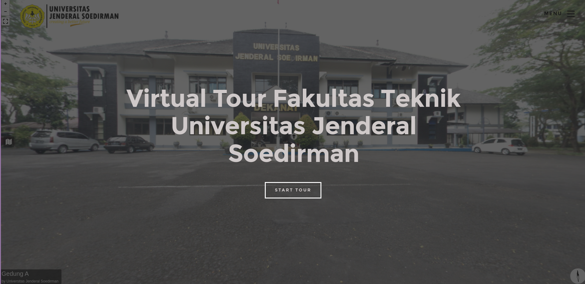
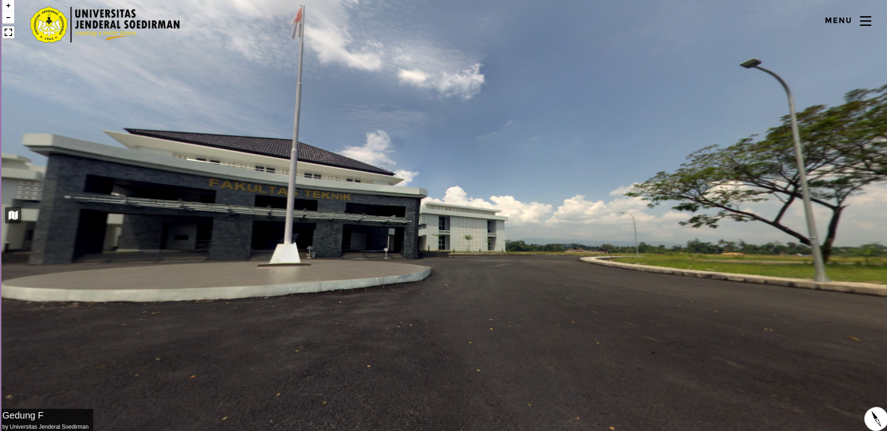

# Virtual Tour using Pannellum

This is my thesis project, created a virtual tour of my campus using [Pannellum](https://pannellum.org/) Package.

# Preview




## Getting started

Please check the official laravel installation guide for server requirements before you start. [Official Documentation](https://laravel.com/docs/8.x/deployment#server-requirements)

Assuming you've already installed on your machine: PHP (>= 7.3.0), [Composer](https://getcomposer.org/), and local web server

## Installation

Clone the repository
```
git clone https://gitlab.com/ariestaazalia/Virtual-Tour-using-Pannellum.git
```

Switch to the folder

Install all the dependencies using composer
```
composer install
```

Copy the env example file and configure 
```
cp .env.example .env
```

Generate key
```
php artisan key:generate
```

Run the database migration (set the database connection in .env first)
```
php artisan migrate --seed
```

Import the Database

Start local development server
```
php artisan serve
```
You can access the app in http://localhost:8000 (Make sure you run your web server, ex: XAMPP, MAMP)

## TLDR
```
git clone https://gitlab.com/ariestaazalia/Virtual-Tour-using-Pannellum.git
composer install
cp .env.example .env
php artisan key:generate
php artisan migrate --seed
php artisan serve
```
